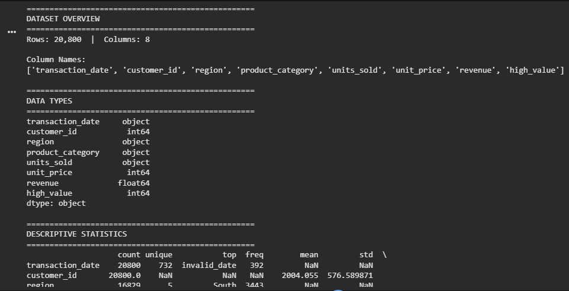
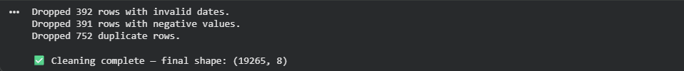
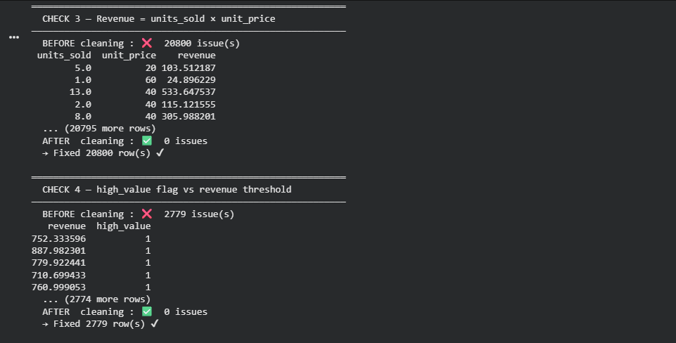
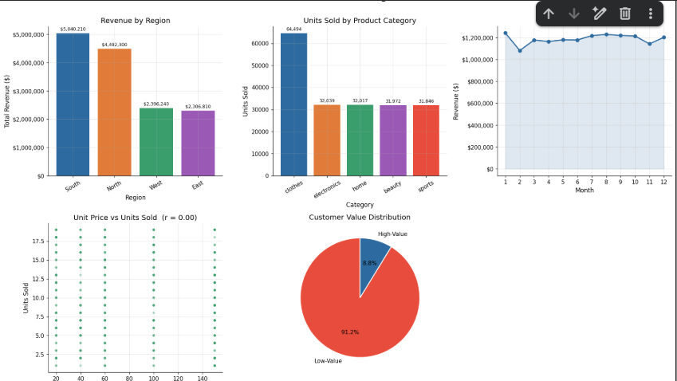

# 🛒 Retail Analytics Pipeline

> End-to-end data analysis pipeline covering EDA, Data Cleaning, Validation, Feature Engineering, and Business Visualizations — built with Python & Pandas.

---

## 📋 Table of Contents

- [Project Overview](#-project-overview)
- [Pipeline Stages](#-pipeline-stages)
- [Project Structure](#-project-structure)
- [Getting Started](#-getting-started)
- [Results & Insights](#-results--insights)
- [Technologies Used](#-technologies-used)

---

## 🔍 Project Overview

This project demonstrates a complete data analysis workflow applied to a retail transaction dataset. The goal is to transform raw, messy data into clean, validated, and insight-ready data — then communicate findings through professional visualizations.

The dataset contains transaction records including sales, pricing, regional performance, and customer behavior data.

---

## 🔄 Pipeline Stages

### 1. 📊 Exploratory Data Analysis (EDA)
Understand the raw dataset before touching it — shape, data types, descriptive statistics, and missing value patterns.



---

### 2. 🧹 Data Cleaning
Fix data types, impute missing values, standardize categorical text, remove invalid rows, recalculate derived columns, and eliminate duplicates.



---

### 3. ✅ Data Quality Validation
Every cleaning decision is verified with a **before/after comparison** across 5 business rules:

| Check | What it verifies |
|---|---|
| Missing Values | No nulls remain after imputation |
| Negative Values | No negative units, price, or revenue |
| Revenue Formula | `revenue = units_sold × unit_price` |
| High-Value Flag | Flag correctly matches the $1,000 threshold |
| Duplicates | No duplicate transaction IDs |



---

### 4. ⚙️ Feature Engineering
Derive business-relevant features to enable deeper analysis:

- **Time features** — Month, Quarter, Day of Week, Weekend flag
- **Revenue features** — Price per unit, Expected revenue, Discount amount & %
- **Customer features** — Total transactions, Total spent, Average spend per transaction
- **Dynamic high-value flag** — Based on top 25% revenue percentile

---

### 5. 📈 Business Visualizations
Five key business insights presented in a unified dashboard:



| Chart | Insight |
|---|---|
| Revenue by Region | Which region drives the most sales |
| Units Sold by Category | Most in-demand product categories |
| Monthly Revenue Trend | Seasonal patterns and peak months |
| Unit Price vs Units Sold | Price sensitivity and demand relationship |
| Customer Value Distribution | Proportion of high-value vs low-value customers |

---

## 📁 Project Structure

```
retail-analytics-pipeline/
│
├── notebook_professional.ipynb     # Main analysis notebook
│
├── assets/
│   └── images/
│       ├── 01_eda_overview.png
│       ├── 02_cleaning_results.png
│       ├── 03_validation_before_after.png
│       └── 04_dashboard.png
│
├── module3_4_full_demo_dataset.csv # Raw dataset (input)
├── cleaned_transaction_dataset.csv # After cleaning
├── featured_transaction_dataset.csv# After feature engineering
│
└── README.md
```

---

## 🚀 Getting Started

### Prerequisites
```bash
pip install pandas numpy matplotlib
```

### Run the Notebook
```bash
git clone https://github.com/AhmedSaber/retail-analytics-pipeline.git
cd retail-analytics-pipeline
jupyter notebook notebook_professional.ipynb
```

> Run cells **in order** — each stage saves a CSV that the next stage reads.

---

## 📊 Results & Insights

After running the full pipeline:

- ✅ Raw data cleaned and validated with **zero remaining issues**
- ✅ **12 new features** engineered from the original columns
- ✅ **5 business insights** visualized in a single dashboard
- ✅ Data ready for downstream modeling or reporting

---

## 🛠️ Technologies Used


---

## 👤 Author

**Ahmed Saber**
- GitHub: [@AhmedSaber](https://github.com/AhmedSaber)
- LinkedIn: [Ahmed Saber](https://linkedin.com/in/AhmedSaber)

---

⭐ If you found this project useful, consider giving it a star!
